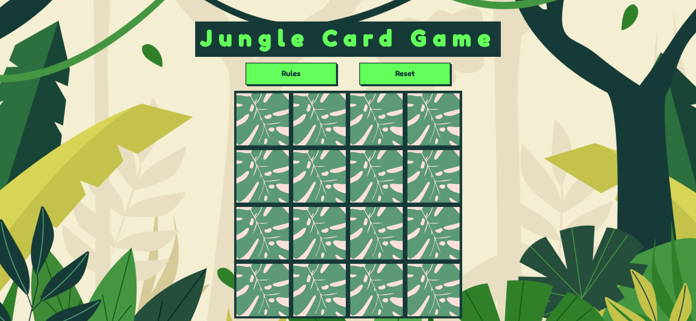
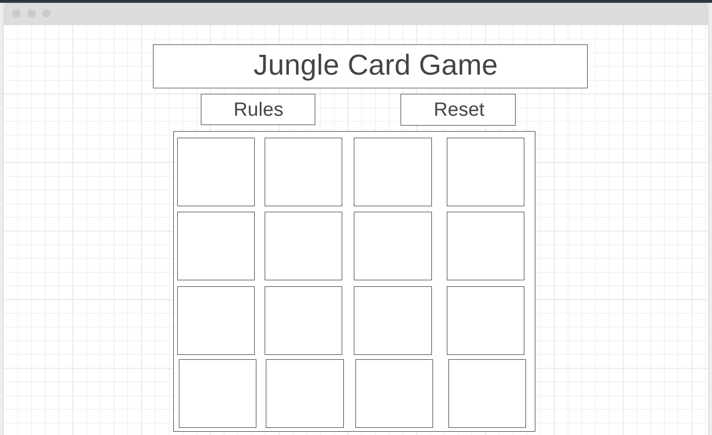
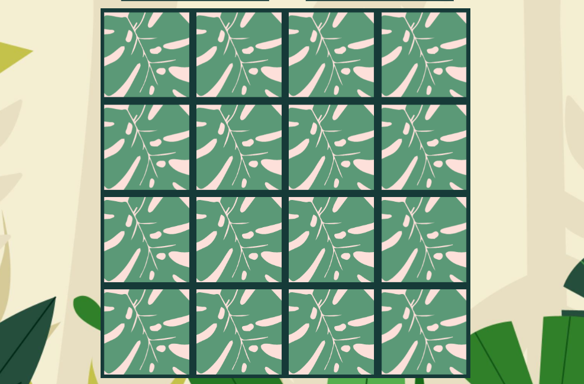
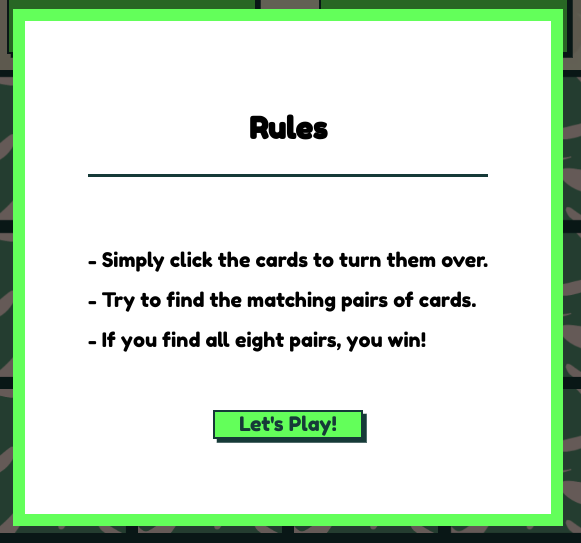
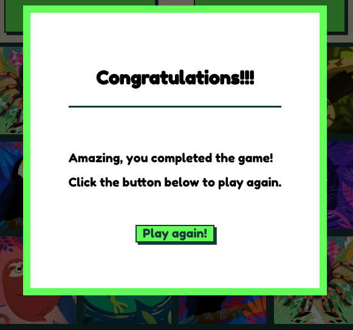
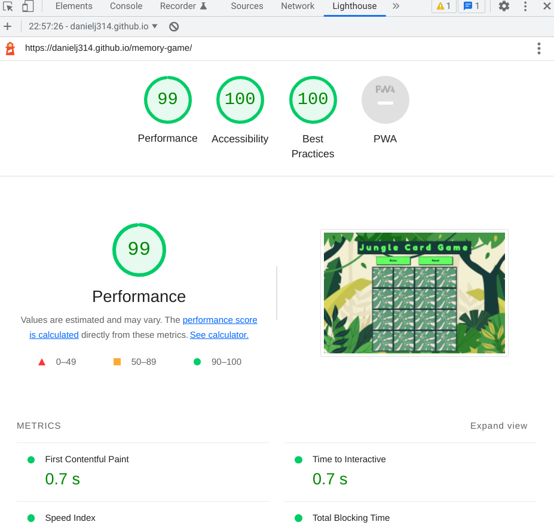

<h1 align="center">Jungle Card Game</h1>

[View the live project here.](https://danielj314.github.io/memory-game/)

This is a memory card game designed for children. The aim of the game is to turn over all of the matching pairs of animal cards. 

The site is built using html CSS and JavaScript.

TESTIIIIIINGGGG

## Wireframe
A wireframe was produced at the beginning of the project using wireframe.cc . This was used for reference during the coding process. Below is a copy of the wireframe:

## Website Features 

- __The 'Jungle Card Game' Heading__

  - Featured at the top of the page, the Jungle Card Game h1 heading is easily visible for the user. Upon opening the page, the user will immediately be able to see the name of the game.

- __Buttons area__

  - Rules button: When clicked, the 'Rules' button opens a modal explaining how the game works and how a player can complete the game.
  - Reset button: When clicked, the 'reset' button resets the game to the starting point.
  - The buttons are responsive. when hovered over, the colour darkens and when clicked, a clicking effect has been added using css.

- __The Game Area__

  - This section will allow the user to play the card game. The cards are spaced out evenly.Each card in the grid is clear for the player to see at different screen sizes. 
  - The cards have an 'active' css effect which ensures the player understands that the card is clickable/responsive.
  - The images selected for the front faces of the cards are brightly coloured and easily distinguishable from one another.
  - The back of the cards have a more neutral colour in order to ensure that they are easily distignuishable from the animals on the front of the cards.

- __The Rules Modal__

  - This section appears when the rules button is clicked. 
  - The modal is clearly visible, with the background darkened to reduce distraction.
  - The "let's play" button at the bottom of the modal is clear and takes the user back to the main game screen.

- __The Win Modal__

  - This section appears when the player matches all the cards. 
  - The modal is clearly visible, with the background darkened to reduce distraction.
  - The "play again" button at the bottom of the modal is clear and takes the user back to the main game screen, and resets the game.

### Features Left to Implement

- In the future a score may be provided in order to show the user how many turns it took them to complete the game.

- An easy, medium and hard version could be added which either adds more cards to the grid or reduces the time allowed to complete the game.

## Testing 

### Manual Testing

- The Website was tested on Google Chrome, Samsung Internet and Safari browsers.
- The website was viewed on a variety of devices such as Desktop, Laptop, Samsung A72 and iPhone X.
- Friends and family members were asked to review the site to ensure it was workable and that they could not find any bugs. They found the game easily playable on a variety of scree sizes, from 320px mobile devices to 1200px desktop screens.
- Testing ws undertaken regularly throughout the development process using Google Chrome's developer tools and "Inspect Mode". 
- The console.log() function was used regularly during JavaScript writing to ensure functions were being called correctly.

### Validator Testing 

- HTML
    - No errors were returned when passing through the official [W3C validator](https://validator.w3.org/nu/?doc=https%3A%2F%2Fdanielj314.github.io%2Fmemory-game%2F)

- CSS
    - No errors were found when passing through the official [(Jigsaw) validator](https://jigsaw.w3.org/css-validator/validator?uri=https%3A%2F%2Fdanielj314.github.io%2Fmemory-game%2F&profile=css3svg&usermedium=all&warning=1&vextwarning=&lang=en)

- JavaScript
    - No errors were found when passing through the official [Jshint validator](https://jshint.com/)
    - There are 17 functions in this file.
    - Function with the largest signature take 1 arguments, while the median is 0.
    - Largest function has 11 statements in it, while the median is 2.
    - The most complex function has a cyclomatic complexity value of 5 while the median is 1.

- Google Lighthouse
    - Google Lighthouse testing was used to ensure that the site met sufficient performance, accessibility and good practice standards. Below is a screenshot of the results:

    

###  Bugs Fixes

- "backface-visibility: hidden;" css was not working when cards were being flipped - after looking at [Teamtreehouse community](https://teamtreehouse.com/community/the-backfacevisibility-property-is-not-working) , it was clear that an additional line of css needed to add "transform-style: preserve-3d;"  to the ".card" parent class in order for bacface-visibility to work.

- If a third card was clicked quickly before the first two cards had flipped back over, this caused a bug whick would keep the third card face up. This bug was fixed by creating a function that locked the board once two cards had been chosen. the board remains locked until the turn is over and the board is reset.

- If the first card turned was double clicked it would remain flipped. This is because the second click was recognised as the second card and the function would identify a matching card to the first click. In order to resolve this, a condition was added to the beginning of the "turnOver" function. This condition ("if (this === firstCard) return;") stopped the same card from being chosen twice.

- When the game was reset by the player, the board would reset but any cards that were matched from the previous game would remain un-clickable. This was finally resolved by adding back the 'click' event listener to the cards within the resetGame function.

### Unfixed Bugs

There are no known bugs on the latest version of the site.

## Deployment

- The project was deployed to GitHub Pages using the following steps:

1. Log in to GitHub and locate the GitHub Repository.
2. At the top of the Repository, locate the "Settings" Button on the menu.
3. Scroll down the Settings page until you locate the "GitHub Pages" Section.
4. Under "Source", click the dropdown called "None" and select "Main".
5. The page will automatically refresh.
6. Scroll back down the page where a new  site link is published in the "GitHub Pages" section.

The live link can be found here - https://danielj314.github.io/memory-game/

- Forking the GitHub Repository:

By forking the GitHub Repository you will make a copy of the original repository on your GitHub account to view and/or make changes without affecting the original repository. Here are the steps to take to achieve this:

1. Log in to GitHub and locate the GitHub Repository
2. Above the Repository, click the "Fork" Button. This will create a copy of the original repository in your GitHub account.

- Creating a Local Clone:

1. Log in to GitHub and locate the GitHub Repository
2. Click the "Clone or download" button.
3. To clone the repository using HTTPS, under "Clone with HTTPS", copy the link.
4. Open Git Bash
5. Change the current working directory to the new location where you want the clone to be created.
6. Type git clone, and paste the URL you copied earlier in Step 3.

### Content 

- Instructions on how to create the javascript code for the game area was taken from [Memory Card Game JavaScript Tutorial](https://youtu.be/ZniVgo8U7ek). This specifically included the code used to flip the cards, to recognise whether or not the cards matched and how to keep the matching cards turned over or to reset non-matching pairs.

### Media

- All of the images used for this site were taken from [mixkit.co](https://mixkit.co/) - a site that offers free stock photos and images.

- Background image was taken from [freepik]("https://www.freepik.com/vectors/flat-nature") (Flat nature vector created by freepik - www.freepik.com) a site that offers free stock photos and images.

 
